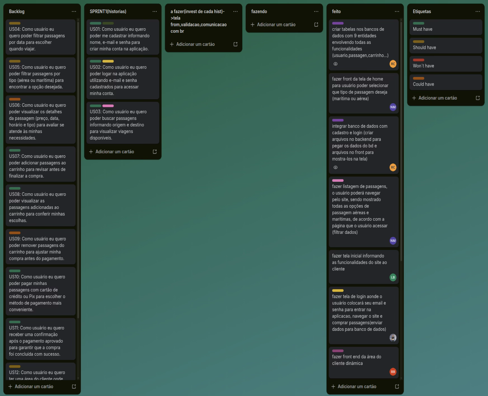
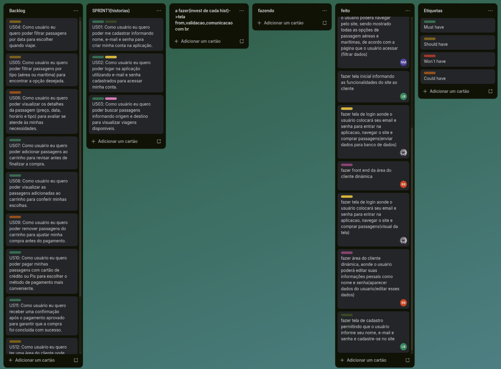
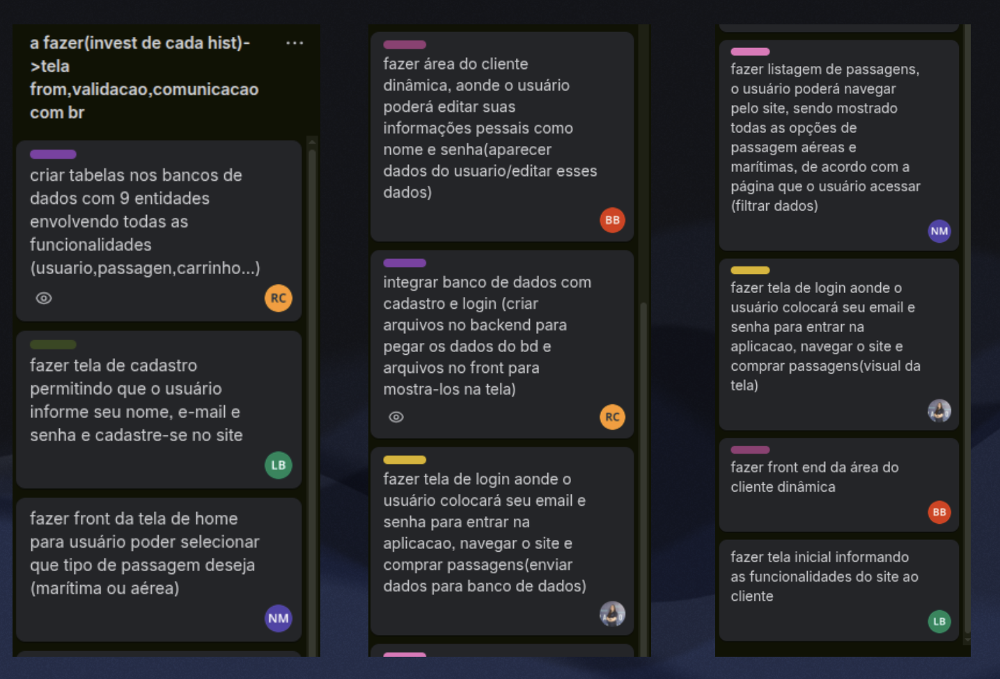
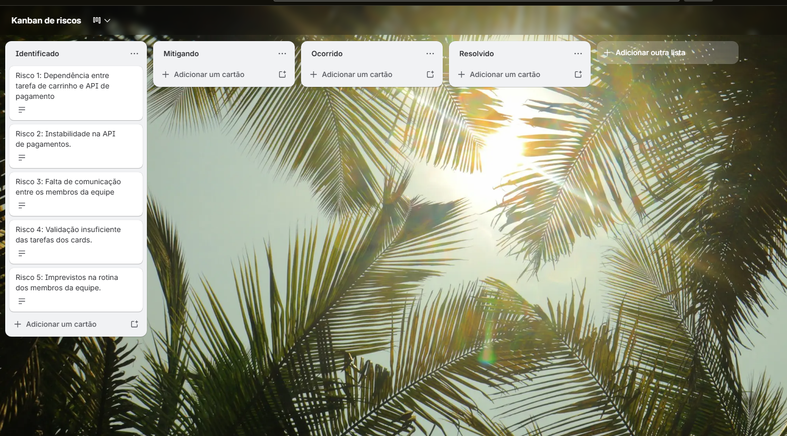
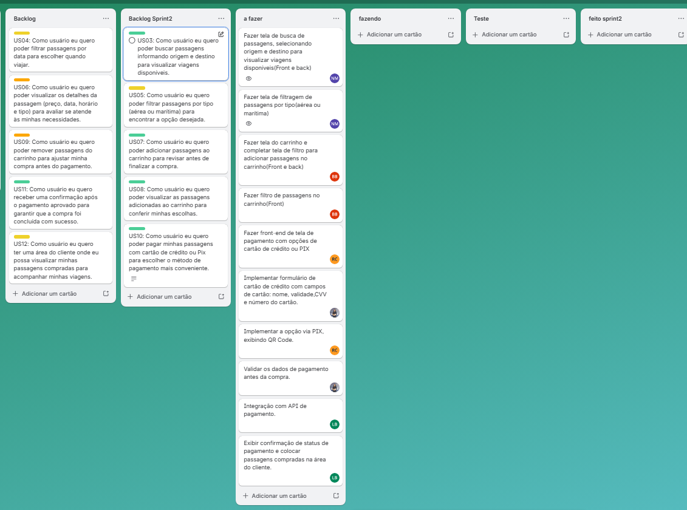

# projeto-gestao-software-passagens

link para  monday: https://rafaelaaltheman2005s-team.monday.com/boards/18399129454

linkscrum poker: https://planningpokeronline.com/08pP4V7D6Gxs9nN2pe18/

trello: https://trello.com/b/dFKQKmqk/projeto-de-gestao-de-software

trello(SPRINT2): https://trello.com/b/R5fAqSF6/projeto-gest%C3%A3o-de-software-horas

trello de riscos: https://trello.com/b/kDRt3btX/kanban-de-riscos

no txt:

-instrucoesParaRodar: encontramos o passo a passo para rodar localmente esse projeto

-componentizacao de telas: encontramos a explicacao sobre a componentizacao de telas um fluxo genérico da aplicacao 

-conceitos base do vue: explico um pouco sobre como usar as propriedades do vue

-------

# -Horas

Sistema para gerenciamento de passagens chamado –Horas, pois os usuários gastarão menos horas fazendo a compra e busca de passagens. 

# Objetivo do Projeto

Desenvolver site para venda de passagens marítimas e aéreas muito mais intuitivo, rápido e fácil para o consumidor do que os demais disponíveis no mercado.

# LAB 5

# LAB 9 - Kanban Sprint 2 e Kanban de risco

